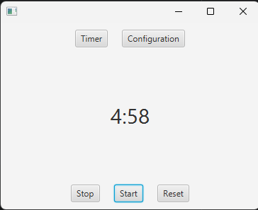
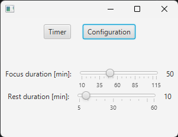

JavaFx Pomodoro desktop application that helps you focus using pomodoro technique.

Most important features:
- Configurable focus and rest time.
- Simple, not distractive UI.
- It runs focus and rest cycles continuously until stopped or re*set.* 
- Ability to set your own sound signals for the end of rest and focus cycle. (In progress) 

PomodoroTimer class is decoupled from the rest of the application, runnable class, so it can be used in any other project.

